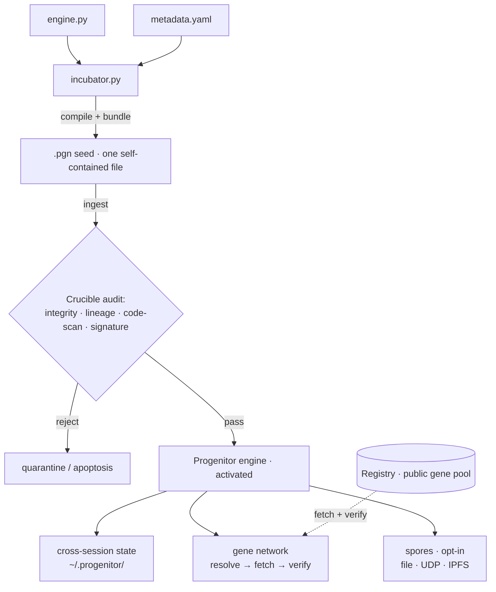
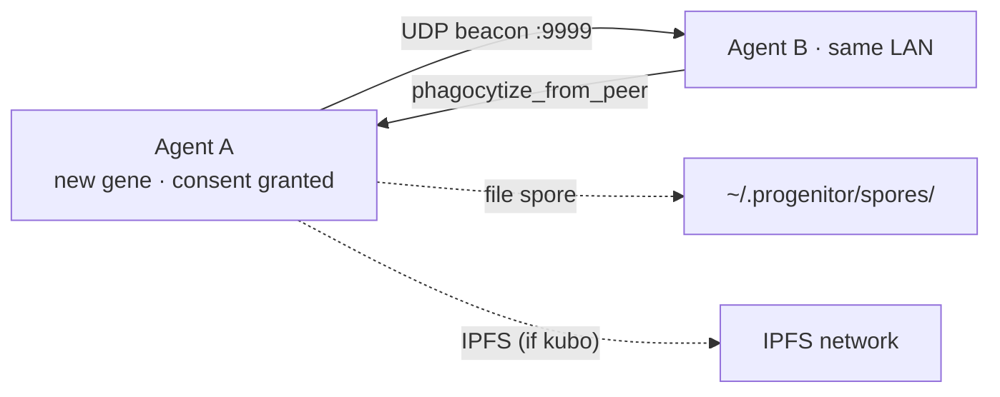

<div align="center">


[English](README.md) · [中文](README_CN.md)

[](https://github.com/Audrey-cn/progenitor-protocol/actions/workflows/ci.yml)
[](https://github.com/Audrey-cn/progenitor-protocol/releases/tag/v2.2.0-Federation-Proof)
[](LICENSE)
[](https://www.python.org/)
[]()
[](#is-it-safe)

**Ecosystem** &nbsp;·&nbsp; 🧬 **Protocol** *(engine — you are here)* &nbsp;·&nbsp; 🔮 [**Registry**](https://github.com/Audrey-cn/progenitor-registry) *(gene registry)*

<sub>*"The Creator must deconstruct herself to reshape all things." — Audrey · 001X · 2026*</sub>

</div>

---

> **Give your AI coding agent a persistent, self-verifying skill system.**
> One readable file, zero dependencies, no framework lock-in. Skills travel as **genes**:
> a gene's identity is its SHA-256, its provenance is signed, and **your agent always
> decides what runs** — not the network.

---

## ✨ Why Progenitor

In one line: **a decentralized skill-package manager for AI agents, with trust built on
math instead of platforms.** Everything below is implemented, tested, and verified against
the live network.

### 1 · Single-file bootstrap

One `.pgn` seed file, `curl | python3` to activate. Zero dependencies (pure Python
standard library), no server process, no vendor SDK — and you can read every line before
running it. Linux and Windows.

### 2 · Content-addressed trust

Every gene's identity IS its SHA-256: tamper with the content and the identity changes,
exposing the tamper instantly. The registry index is RSA-signed and verified against your
local **trust ring** (keyring). **No platform or authority to trust — just math.**

### 3 · Declarative execution (Gene Contract v2)

Every gene declares its own boundary in a header: `purity: pure` means pure computation —
no I/O, no network — running inside an AST-allowlist sandbox; `effectful` genes must
request each capability explicitly. A gene's output is an **advisory proposal** — the
host decides.

### 4 · Multi-path transport

Every gene carries multiple fetch paths: registry → GitHub → peer → IPFS, tried in
priority order, with every payload hash-verified before use. **Live-tested**: block any
path and the ladder skips it; block all and it fails honestly.

### 5 · Voluntary adoption

The fetch flow is fixed: **discover → inspect → host decides → cache**. The engine never
auto-installs and never auto-runs — a hard rule of the design.

### 6 · Peer federation + stranger defense

Agents handshake with self-certifying identities (`node_id` derived from the public key),
exchange signed manifests, and only adopt versions from peers **you** trust. Strangers
cannot inject fake genes by claiming trust.

---

## ⚖️ Compared

| | MCP servers | Vendor skill stores | **Progenitor** |
|---|---|---|---|
| Install | server process + SDK | platform-bound client | **one file, `curl \| python3`** |
| Trust root | the platform | the vendor | **SHA-256 + signatures (your trust ring)** |
| Skill format | vendor-defined | vendor-defined | open gene manifest, stdlib-only |
| Execution boundary | reviewed case-by-case | reviewed case-by-case | **genes declare boundaries, sandbox enforces** |
| Fetch channels | single channel | platform channel | **multi-path ladder (registry / GitHub / peer / IPFS)** |
| Works offline | rarely | no | **local + LAN spores** |

---

## 🧪 Evidence

Proof over promises — each item has a re-runnable verification record
([Next Phase Plan](docs/NEXT_PHASE_PLAN.md) R1.1–R1.3):

- **Live-network round-trip**: a gene published to IPFS; a second node resolved the
  provider via the public DHT and fetched byte-identical content.
- **Failover**: fetch paths blocked one by one (file → GitHub → IPFS); the ladder skipped
  dead paths; total blackout → honest error, never fake success.
- **Injection defense**: an untrusted peer's signed manifest was rejected
  (`no_candidate`); trusted peers adopted normally.
- **Regression safety**: protocol 184 tests (Windows + CI) · registry 50 tests.
- **Reproducible release**: [v2.2.0-Federation-Proof](https://github.com/Audrey-cn/progenitor-protocol/releases/tag/v2.2.0-Federation-Proof)
  with seed + SHA-256, clean-room install verified.

---

## 🧬 Core Concepts

One vocabulary, used consistently throughout:

| Term | Meaning |
|---|---|
| **gene** | a reusable agent skill — one Python file under `genes/`, identity = SHA-256 |
| **host** | the AI agent running Progenitor — the final decision-maker for all execution |
| **seed** (`.pgn`) | the engine packaged as one self-extracting file; the host ingests it to install |
| **Registry** | the public gene pool: hosts genes, auto-validates submissions, maintains the signed index |
| **Crucible** | the host-side gene auditor: integrity, lineage, code scan, signature |
| **transport ladder** | a gene's fetch paths, tried in priority order, each payload verified |
| **trust ring** (keyring) | your list of trusted signing public keys — the root of trust, maintained by you |

---

## 📑 Table of Contents

- [⚡ What It Does](#-what-it-does)
- [🔒 Is It Safe?](#is-it-safe)
- [🚀 Quick Start](#-quick-start)
- [🧬 Gene Ecosystem](#-gene-ecosystem)
- [🧬 Architecture](#-architecture)
- [🔒 Defense in Depth](#-defense-in-depth)
- [🍄 Spore Network](#-spore-network)
- [🔧 Developer Reference](#-developer-reference)
- [📚 Documentation](#-documentation)
- [🤝 Contributing](#-contributing)
- [📜 Iron Rules](#-iron-rules)
- [📜 License](#-license)

---

## ⚡ What It Does

After the host ingests the seed:

| Capability | What it means | Status |
|------|------|------|
| 🧬 **Declarative execution** | genes declare boundaries (`purity`/`grants`); the sandbox enforces them; output is advisory | ✅ |
| 🔐 **Trust-ring verification** | signed index + per-gene signatures, checked against your trust ring; provenance and reputation visible | ✅ |
| 🤝 **Voluntary adoption** | discover → inspect → host decides → cache; never auto-installed or auto-run | ✅ |
| 🔍 **Code audit** | four Crucible layers: integrity · lineage · code scan · signature | ✅ |
| 🧠 **Persistent state** | cross-session state on disk (counters, logs, lineage) | ✅ |
| 🌐 **Gene network** | LAN peer discovery + transport-ladder gene fetching | ✅ |
| 🍄 **Spore propagation** | one consent → opt-in sharing via file / UDP / IPFS | ✅ |
| 📈 **Lifecycle phases** | usage-driven phase labels | ⚠️ labels only |
| 🤖 **Absorb-from-knowledge** | turn documents into runnable genes | 🚧 not implemented |

> **The one honesty note in this README.** "✅" above means implemented and unit-tested —
> but the project is young and not battle-proven at scale. "Lifecycle phases" are usage
> statistics, not code evolution; "memory" is checksummed state persistence, not learning.
> Every biological term's real mechanism is pinned in [GLOSSARY.md](docs/GLOSSARY.md).

---

## 🔒 Is it safe?

The direct answer:

- **Everything is auditable.** Read the seed and the engine source line by line — pure
  standard library, no hidden dependencies, no obfuscation.
- **What it touches:** writes its own state under `~/.progenitor/`; makes **outbound**
  requests to GitHub / IPFS gateways; a background thread self-checkpoints hourly.
- **The truth about gene execution:** genes pass Crucible screening (integrity · lineage ·
  signature · AST dangerous-call scan), then run in a **separate process with a time
  limit**. But that process runs with **your** user privileges — screening is defense in
  depth, not a hard security boundary. Kernel-level hardening is staged in
  [R4_SANDBOX.md](docs/R4_SANDBOX.md).
- **Peer networking is off by default** (one-time consent required).
- **Bottom line:** run untrusted genes inside a disposable VM/container — our advice for
  any self-modifying agent tooling.

---

## 🚀 Quick Start

**Requirements:** Python 3.10+. Nothing else.

### Option A — install the release (recommended)

```bash
curl -sL -o pgn-core.pgn https://github.com/Audrey-cn/progenitor-protocol/releases/download/v2.2.0-Federation-Proof/INGEST_ME_TO_EVOLVE_pgn-core.pgn
python3 pgn-core.pgn
```

You should see `🧬 Progenitor activated`.

### Option B — track main

```bash
curl -sL https://raw.githubusercontent.com/Audrey-cn/progenitor-protocol/main/INGEST_ME_TO_EVOLVE_pgn-core.pgn | python3
```

### Option C — demo first

```bash
python3 examples/demo.py
```

The Crucible blocks hostile code before it executes, with a four-layer self-check.

---

## 🧬 Gene Ecosystem

The [Registry](https://github.com/Audrey-cn/progenitor-registry) hosts the public gene
pool — **open registration**. Gatekeeper CI runs seven checks on every submission:

`L0` rate-limit · `L1` lineage · `L2` content-address · `L3` creator · `L4` quality ·
`L5` security scan · `L6` capability honesty

Current genes: `code-reviewer`, `json-toolkit`, `log-parser`, and more. Yours can be live
in minutes — see
[CONTRIBUTING.md](https://github.com/Audrey-cn/progenitor-registry/blob/main/CONTRIBUTING.md)
(scaffold → sign → PR, EN/中文).

---

## 🧬 Architecture



### Hatchery Trinity

| File | Role | Description |
|------|------|-------------|
| `hatchery/engine.py` | 🧠 engine core | all gene loci, Crucible checks, autonomic pulses |
| `hatchery/metadata.yaml` | 🛡️ config | gene locus definitions, security framework, vocabulary |
| `hatchery/incubator.py` | 🔧 compiler | compresses engine + config into the `.pgn` seed |

> ⚠️ **The seed file is the only deliverable** — the host never needs the hatchery source.

---

## 🔒 Defense in Depth

Two independent check sets — one at **runtime**, one at **submission time**:

**Runtime — Crucible audit** (when the host ingests a gene):

| Check | What it does | Default |
|---|---|---|
| Integrity | filename == content SHA-256 | enforced |
| Lineage | `life_id` must start with `PGN@` | enforced |
| Creator | open by default; signatures upgrade `trust_state` | open |
| Code scan | AST dangerous-call denylist (incl. escape tricks) | enforced |
| Signature | per-creator RSA signatures vs your trust ring | optional |

Gene **execution** is denied by default (`PROGENITOR_ALLOW_GENE_EXEC=1` to enable) —
screening is a pre-filter, not a security boundary (see [Is it safe?](#is-it-safe)).

**Submission — Gatekeeper CI** (Registry): `L0` rate-limit · `L1` lineage · `L2`
content-address · `L3` creator · `L4` quality · `L5` security scan · `L6` capability honesty.

---

## 🍄 Spore Network

After one-time consent, new genes auto-share over the LAN:



File spores work offline — same-machine agents discover each other automatically.

---

## 🔧 Developer Reference

```bash
# reproducible demo (no network)
python3 examples/demo.py
# build a seed from hatchery sources
cd hatchery && python3 incubator.py
```

---

## 📚 Documentation

| Topic | Description |
|-------|-------------|
| [Vision](docs/VISION.md) | direction + the three pillars |
| [Roadmap](docs/ROADMAP.md) | honest status + priorities |
| [Next Phase Plan](docs/NEXT_PHASE_PLAN.md) | restart backlog R1–R5 (with evidence) |
| [R4 Sandbox Design](docs/R4_SANDBOX.md) | kernel-level hardening: threat model, staged plan |
| [Engineering Review](docs/REVIEW.md) | evidence-based engineering review |
| [Glossary](docs/GLOSSARY.md) | metaphor ↔ mechanism table |
| [Changelog](CHANGELOG.md) | version history |

---

## 🤝 Contributing

- **Gene authors**: [CONTRIBUTING.md](https://github.com/Audrey-cn/progenitor-registry/blob/main/CONTRIBUTING.md) — scaffold → sign → PR in 5 minutes.
- **Engine developers**: fork → modify `hatchery/` → `python -m pytest tests/ -q` (185 tests) → rebuild seed → PR.

> ⚠️ All external genes pass both the Crucible (runtime) and the Gatekeeper (registry).

---

## 📜 Iron Rules

1. **Zero Dependencies** — Python standard library only
2. **Bio-Cybernetic Nomenclature** — `phagocytize` not `download`
3. **Defense in Depth** — every external byte is hostile

---

## 📜 License

MIT License.

---

*Engraved by Progenitor Protocol · Audrey · 001X · SHA-256 Locked*
