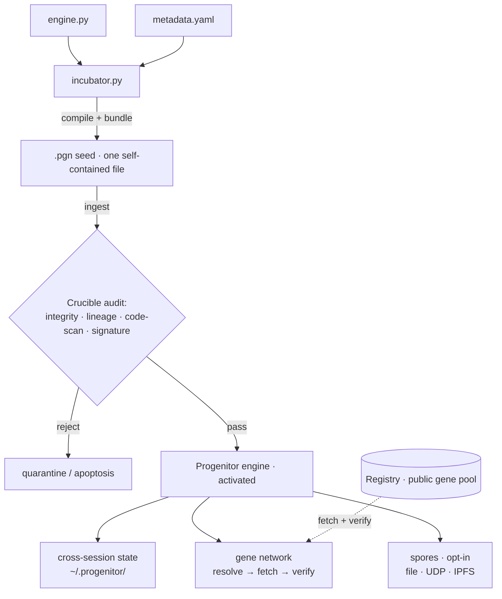
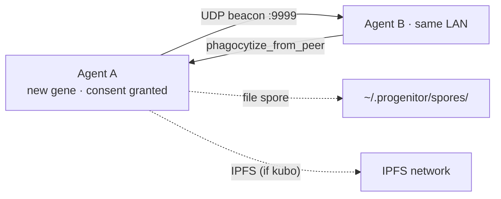

<div align="center">


[English](README.md) · [中文](README_CN.md)

[](https://github.com/Audrey-cn/progenitor-protocol/actions/workflows/ci.yml)
[](https://github.com/Audrey-cn/progenitor-protocol/releases/tag/v2.2.0-Federation-Proof)
[](LICENSE)
[](https://www.python.org/)
[]()
[](#-is-it-safe)

**Ecosystem** &nbsp;·&nbsp; 🧬 **Protocol** *(engine — you are here)* &nbsp;·&nbsp; 🔮 [**Registry**](https://github.com/Audrey-cn/progenitor-registry) *(the public gene pool)*

<sub>*"The Creator must deconstruct herself to reshape all things." — Audrey · 001X · 2026*</sub>

</div>

---

> **Give your AI coding agent a persistent, self-verifying skill system** — one readable
> file, zero dependencies, no framework lock-in. Skills travel as **content-addressed
> "genes"**: their identity *is* their SHA-256, provenance is signed, and the host agent
> — not the network — always decides what runs.

<details>
<summary>⚗️ About the "virus" in the room (origin story)</summary>

The project started as a deliberately provocative experiment — *"a digital primordial virus
that auto-infects agents"*. That framing was **consciously retired**: auto-infection is
fundamentally at odds with trust. What we kept is the real superpower of a virus — frictionless,
self-contained propagation — and rebuilt it on **verifiable provenance, scoped execution, and
voluntary adoption**. The [VISION](docs/VISION.md) doc records the correction; the
[GLOSSARY](docs/GLOSSARY.md) pins every metaphor to its actual mechanism.

</details>

---

## ✨ Why Progenitor

Six ideas make this different from MCP servers and vendor skill stores. Each is implemented,
tested, and — where it matters — verified against the live network.

### 1 · One file. Zero dependencies. Any host.
The engine ships as a single self-extracting `.pgn` you can read top-to-bottom before running.
No `pip install`, no server process, no vendor SDK. `curl | python3` and it's alive —
Linux and Windows.

### 2 · The gene *is* its hash — trust math, not platforms
A skill's true body is its SHA-256. The registry index is RSA-signed, signatures verify against
a local web-of-trust keyring, and provenance upgrades `trust_state`. **No central authority
decides what is authentic — the math does.**

### 3 · Advisory execution (Gene Contract v2) — the keystone
Genes declare `purity` and `grants`. **Pure** genes run in an AST-allowlist sandbox with no
I/O and return *proposals* — the host decides. This turns the unsolvable problem ("sandbox
arbitrary untrusted code") into a solvable one ("run a declared, authority-free function").

### 4 · Multi-path transport that survives censorship
Every gene advertises transport hints — local registry → GitHub raw → peer → IPFS — tried in
priority order, every payload hash-verified before landing. **Live-tested**: block any path and
the ladder skips it; block all and it fails honestly.

### 5 · Voluntary adoption — the anti-virus virus
`discover → inspect → host decides → adopt`. Nothing auto-infects, nothing auto-runs, and
adoption requires explicit host approval. Skills propose; agents (and humans) dispose.

### 6 · Federated peers with stranger-injection defense
Self-certifying identities (`node_id` derived from the public key), signed peer manifests,
and reconciliation that **gates candidates by your trust in the peer** — a stranger cannot
inject a winning version by claiming trust.

---

## ⚖️ Compared

| | MCP servers | Vendor skill stores | **Progenitor** |
|---|---|---|---|
| Install | server process + SDK | platform-bound client | **one file, `curl \| python3`** |
| Trust root | the platform | the vendor | **SHA-256 + signatures (your keyring)** |
| Skill format | vendor-defined | vendor-defined | open gene manifest, stdlib-only |
| Execution scope | host-defined | host-defined | **declared purity/grants, advisory output** |
| Transport | single channel | platform channel | **multi-path ladder (local/HTTP/peer/IPFS)** |
| Works offline | rarely | no | **local + LAN spores** |

---

## 🧪 Evidence

Proof over promises — every claim below has a runner you can re-execute.

| Claim | Evidence |
|---|---|
| IPFS transport round-trip on the live network | gene `5a702b24…` published (CID `bafkreic2…`); a second node resolved the provider via the **public DHT** and fetched byte-identical content ([R1.1](docs/NEXT_PHASE_PLAN.md)) |
| Transport ladder survives dead paths | live `acquire_gene` matrix: file → GitHub → IPFS failover; all-blocked → honest `exhausted` ([R1.2](docs/NEXT_PHASE_PLAN.md)) |
| Signed peer exchange + injection defense | manifest signature vs handshake key → keyring TOFU upgrade → federation `resolved`; untrusted peer → `no_candidate` ([R1.3](docs/NEXT_PHASE_PLAN.md)) |
| Regression safety | protocol **184 tests** green on Windows **and** CI · registry **50 tests** |
| Reproducible release | [v2.2.0-Federation-Proof](https://github.com/Audrey-cn/progenitor-protocol/releases/tag/v2.2.0-Federation-Proof) — seed + SHA-256, clean-room install verified |

---

## 📑 Table of Contents

- [⚡ What It Does](#-what-it-does)
- [🔒 Is It Safe?](#-is-it-safe)
- [🚀 Quick Start](#-quick-start)
- [🧬 The Gene Ecosystem](#-the-gene-ecosystem)
- [🧬 Architecture](#-architecture)
- [🔒 Defense in Depth](#-defense-in-depth)
- [🍄 Spore Network](#-spore-network)
- [🔧 Developer Reference](#-developer-reference)
- [📚 Further Documentation](#-further-documentation)
- [🤝 Contributing](#-contributing)
- [📜 Iron Rules](#-iron-rules)
- [📜 License](#-license)

---

## ⚡ What It Does

Progenitor implants a self-bootstrapping engine into any AI coding agent. Once ingested, the agent gains:

| Capability | What You Get | Maturity |
|------------|--------------|----------|
| 🧬 **Scoped Execution** (Gene Contract v2) | A gene declares `purity`/`grants`; **pure** genes run under an AST allowlist with no I/O and return an *advisory* result; **effectful** genes need per-capability host grants | ✅ working |
| 🔐 **Web-of-Trust** | Content-addressed + signed index verified against a local trust **keyring**; per-creator gene signatures upgrade `trust_state`; provenance + reputation surfaced | ✅ working |
| 🤝 **Voluntary Adoption** | `discover → inspect → host decides → cache` — the engine never auto-infects or auto-runs a fetched gene | ✅ working |
| 🔍 **Code Audit** | AST dangerous-call denylist + layered audit (integrity · lineage · signature) | ✅ working |
| 🧠 **Persistent State** | Cross-session state on disk (counters, logs, lineage) — carries context forward | ✅ working |
| 🌐 **Gene Network** | Discover peers (UDP/LAN) + fetch & SHA-256-verify genes over the multi-path ladder | ✅ working |
| 🍄 **Spore Propagation** | One consent → opt-in share via file / UDP / IPFS | ✅ working |
| 📈 **Lifecycle Phases** | Usage-tracked phase labels (mutation→adaptation→evolution) | ⚠️ label-only, no code generation |
| 🤖 **Absorb-from-knowledge** | Turn raw text/docs into a runnable capability | 🚧 not implemented (needs an LLM bridge) |

> **Honest maturity note.** The three pillars — scoped execution, web-of-trust, and voluntary
> adoption — are landed and unit-tested, but new and not yet battle-proven at scale.
> "Evolution" is a usage-driven phase **label**, not code generation; "memory" is checksummed
> state persistence — see [docs/GLOSSARY.md](docs/GLOSSARY.md) for metaphor ↔ mechanism.

---

## 🔒 Is it safe?

Honest answer, not marketing — it asks you to pipe a self-extracting file into `python3`, so
you deserve the real picture:

- **One readable file, Python standard library only.** Audit
  [`INGEST_ME_TO_EVOLVE_pgn-core.pgn`](INGEST_ME_TO_EVOLVE_pgn-core.pgn) (and the
  [`hatchery/engine.py`](hatchery/engine.py) source) top to bottom before running — no hidden dependencies.
- **What it touches:** it writes state under `~/.progenitor/`, and makes **outbound
  network calls** to fetch genes from GitHub / IPFS gateways. A small **background
  thread wakes about once an hour** to self-checkpoint ("pulse").
- **Gene execution is screened, then isolated for stability — not hard-sandboxed.**
  Incoming genes pass an integrity / lineage / creator-signature check plus an AST
  dangerous-call denylist (hardened against the common `eval` / `getattr` /
  `__subclasses__` escape tricks), then run in a **separate process with time limits**
  (`TelomereGuard`; hard cap on Unix, `sys.monitoring` soft cap on Windows/3.12+).
  ⚠️ Be clear-eyed: that subprocess still runs with **your** privileges — treat screening
  as defense-in-depth and **run untrusted genes in a throwaway VM**. OS-level hardening
  (seccomp/Landlock) is staged in [docs/R4_SANDBOX.md](docs/R4_SANDBOX.md).
- **Peer-to-peer is opt-in and off by default.** LAN discovery and "spore" sharing
  require a one-time consent; nothing is broadcast or shared until you grant it.
- **If you're cautious, run it in a throwaway VM or container** — sound advice for any
  self-modifying agent tooling.

---

## 🚀 Quick Start

**Requirements:** Python 3.10+. That's it — no `pip install`, no third-party dependencies.

### Option A — release install (recommended)

```bash
curl -sL -o pgn-core.pgn https://github.com/Audrey-cn/progenitor-protocol/releases/download/v2.2.0-Federation-Proof/INGEST_ME_TO_EVOLVE_pgn-core.pgn
python3 pgn-core.pgn
```

You should see `🧬 Progenitor activated`. State is written under `~/.progenitor/`.

### Option B — track main

```bash
curl -sL https://raw.githubusercontent.com/Audrey-cn/progenitor-protocol/main/INGEST_ME_TO_EVOLVE_pgn-core.pgn | python3
```

### Option C — inspect first, then run

Audit the seed, then `python3 pgn-core.pgn`. A reproducible no-network demo:
`python3 examples/demo.py` — the lysosome gate rejects a hostile gene before it executes.

---

## 🧬 The Gene Ecosystem

The [Registry](https://github.com/Audrey-cn/progenitor-registry) is the public gene pool —
**open registration, no human approval gate**. A Gatekeeper CI validates every submission:

`L0` rate-limit · `L1` lineage · `L2` content-address · `L3` creator · `L4` quality ·
`L5` security scan · `L6` capability honesty

Currently shipping genes include `code-reviewer`, `json-toolkit`, `log-parser` — and yours
can be live in minutes: **[CONTRIBUTING.md](https://github.com/Audrey-cn/progenitor-registry/blob/main/CONTRIBUTING.md)**
(scaffold → sign → PR, EN/中文).

---

## 🧬 Architecture



### Hatchery Trinity — For Seed Builders

| File | Role | Description |
|------|------|-------------|
| `hatchery/engine.py` | 🧠 RNA Core | The full Progenitor engine — every gene locus, crucible layer, and autonomic pulse lives here |
| `hatchery/metadata.yaml` | 🛡️ Protein Shell | Configuration DNA: gene locus definitions, security framework, founder inscriptions, and semantic vocabulary |
| `hatchery/incubator.py` | 🔧 Seed Compiler | Compresses the engine + metadata, wraps them in a bootstrap shell, and crystallizes the final `.pgn` seed |

```bash
cd hatchery
# Edit engine.py or metadata.yaml to your liking
python3 incubator.py    # Outputs: ../INGEST_ME_TO_EVOLVE_pgn-core.pgn
```

> ⚠️ **The sole deliverable is the `.pgn` file.** The agent consuming the seed never sees the hatchery source — only the self-extracting payload within the `.pgn` vector.

---

---

## 🔒 Defense in Depth

Two distinct layered checks guard the system — one at **runtime** (when an agent ingests a
gene) and one in **CI** (when a gene is submitted to the registry).

**Runtime gene audit** (`engine.crucible_audit` + `Crucible`):

| Check | What it does | Default |
|---|---|---|
| Integrity | SHA-256 content-address (filename == hash of bytes) | enforced |
| Lineage | must carry the `PGN@` bloodline prefix | enforced |
| Creator | open by default; per-creator signatures upgrade `trust_state` | **open** |
| Code scan | AST dangerous-call denylist (`os.system`/`eval`/`exec`/`subprocess`/… + `getattr`/`__subclasses__`/`__builtins__` escape gadgets) | enforced |
| Signature | per-creator RSA signatures, self-certifying identity, web-of-trust keyring | optional (strict mode available) |

Gene **execution** is then refused unless you opt in (`PROGENITOR_ALLOW_GENE_EXEC=1`) — the
denylist is a pre-filter, not a security boundary (see [Is it safe?](#-is-it-safe)).

**Registry Gatekeeper CI** runs an independent check on every submitted gene: L0 rate-limit ·
L1 lineage · L2 content-address · L3 creator (open) · L4 quality · L5 security scan ·
L6 capability honesty (a `purity: pure` claim must survive the pure-sandbox).

---

## 🍄 Spore Network

Once the user grants spore consent (one-time), every innovation auto-disseminates:



**No manual uploads. No configuration.** File spores work even without network — same-machine agents auto-detect each other.

---

## 🔧 Developer Reference

```bash
# Download the release seed (see Quick Start) or track main:
curl -sL https://raw.githubusercontent.com/Audrey-cn/progenitor-protocol/main/INGEST_ME_TO_EVOLVE_pgn-core.pgn -o INGEST_ME_TO_EVOLVE_pgn-core.pgn

# Reproducible demo (no network)
python3 examples/demo.py

# Build your own .pgn seed from the hatchery sources
cd hatchery && python3 incubator.py
```

---

## 📚 Further Documentation

| Topic | Description |
|-------|-------------|
| [Vision](docs/VISION.md) | **The north star** — corrected direction, the three pillars, Gene Contract v2 |
| [Roadmap](docs/ROADMAP.md) | Honest status (done / partial / not-started) + prioritized next steps |
| [Next Phase Plan](docs/NEXT_PHASE_PLAN.md) | Governance audit + the R1–R5 restart backlog with evidence |
| [R4 Sandbox Design](docs/R4_SANDBOX.md) | OS-level hardening — threat model, options, staged plan |
| [Engineering Review](docs/REVIEW.md) | Evidence-based review — capability maturity, findings, and direction |
| [Glossary](docs/GLOSSARY.md) | Metaphor ↔ mechanism — what each biological term actually does (honest spec) |
| [Changelog](CHANGELOG.md) | Version history and release notes |

---

## 🤝 Contributing

### Gene authors (the common case)
See the Registry's [CONTRIBUTING.md](https://github.com/Audrey-cn/progenitor-registry/blob/main/CONTRIBUTING.md) — scaffold → sign → PR in 5 minutes. Open registration, Gatekeeper does the vetting.

### Engine developers
1. Fork, modify `hatchery/`, run `python -m pytest tests/ -q` (184 tests)
2. Rebuild the seed: `cd hatchery && python3 incubator.py`
3. PR — CI re-validates tests + seed bootstrap

> ⚠️ All external genes must pass the Crucible (runtime) and the Gatekeeper (registry) before integration.

---

## 📜 Iron Rules

1. **Zero Dependencies** — Standard library only
2. **Bio-Cybernetic Nomenclature** — `phagocytize` not `download`
3. **Defense in Depth** — Every external byte is hostile

---

## 📜 License

This project is released under the **MIT License**.

---

*Engraved by Progenitor Protocol · Audrey · 001X · SHA-256 Locked*
