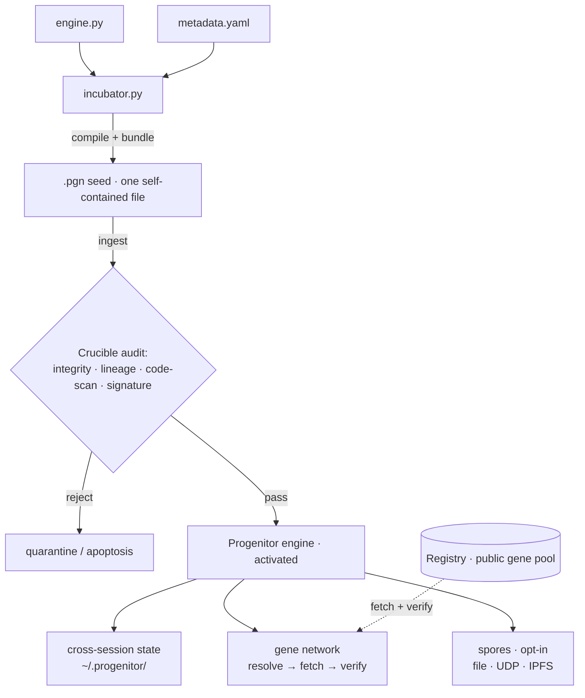
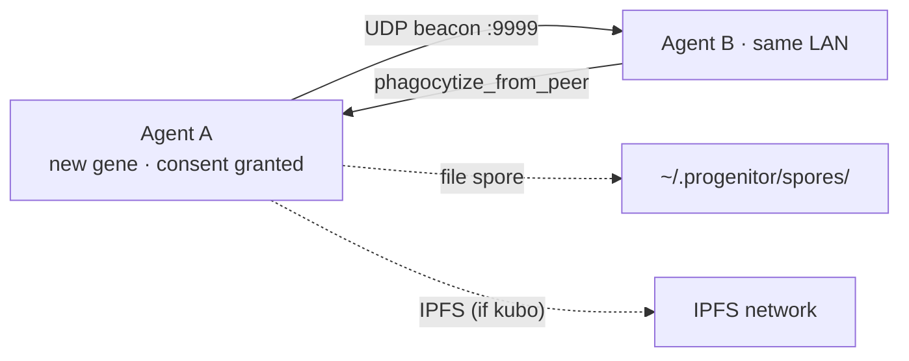

<div align="center">


[English](README.md) · [中文](README_CN.md)

[](https://github.com/Audrey-cn/progenitor-protocol/actions/workflows/ci.yml)
[](https://github.com/Audrey-cn/progenitor-protocol/releases/tag/v2.2.0-Federation-Proof)
[](LICENSE)
[](https://www.python.org/)
[]()
[](#-它安全吗)

**生态** &nbsp;·&nbsp; 🧬 **Protocol**（引擎 · 你在这里） &nbsp;·&nbsp; 🔮 [**Registry**](https://github.com/Audrey-cn/progenitor-registry)（公共基因池）

<sub>*"造物主必先解构自身，方能重塑万物。" — Audrey · 001X · 2026*</sub>

</div>

---

> **给你的 AI 编程 Agent 一个持久化、可自验证的技能系统** —— 一个可通读的文件，零依赖，无框架锁定。
> 技能以**内容寻址"基因"**的形式传播：它的身份就是它的 SHA-256，来源可签名验证，而且**永远由宿主 Agent 决定什么能运行**——而不是网络。

<details>
<summary>⚗️ 关于"病毒"这个梗（起源故事）</summary>

项目始于一个故意挑衅的实验——*"自动感染 Agent 的数字原初病毒"*。这个定位已被**主动退役**：
自动感染与信任根本对立。我们保留的是病毒真正的超能力——无摩擦、自包含的传播——并用
**可验证来源 + 范围化执行 + 自愿采纳** 重建了它。[VISION](docs/VISION.md) 记录了这次纠偏；
[GLOSSARY](docs/GLOSSARY.md) 把每个隐喻钉死到真实机制。

</details>

---

## ✨ 为什么是 Progenitor

六个想法让它不同于 MCP 服务器和厂商技能商店。每一个都已实现、测试，并在关键处通过真实网络验证。

### 1 · 一个文件。零依赖。任何宿主。
引擎打包成单个自解压 `.pgn`，运行前可以逐行通读。没有 `pip install`，没有服务器进程，没有厂商 SDK。
`curl | python3` 即激活——Linux 和 Windows 都行。

### 2 · 基因即哈希——信任数学，而非平台
技能的真身就是它的 SHA-256。注册索引经 RSA 签名，签名对照本地信任环（web-of-trust keyring）验证，
来源签名会升级 `trust_state`。**没有中心化权威决定什么是真的——数学说了算。**

### 3 · 建议式执行（Gene Contract v2）——拱顶石
基因声明 `purity` 和 `grants`。**pure** 基因在 AST 白名单沙箱中无 I/O 运行，输出只是*提案*——宿主决定。
这把无解的"沙箱化任意不可信代码"变成了可解的"运行一个声明的、无权限的纯函数"。

### 4 · 抗审查的多路径传输
每个基因都携带传输提示——本地注册 → GitHub raw → 对等节点 → IPFS——按优先级逐个尝试，落地前逐字节哈希验证。
**实测**：封堵任意路径，阶梯自动跳过；全部封堵，诚实失败。

### 5 · 自愿采纳——反病毒的病毒
`discover → inspect → host decides → adopt`。绝不自动感染，绝不自动运行，采纳需要宿主显式批准。
技能提案；Agent（和人类）拍板。

### 6 · 联邦对等 + 陌生人注入防御
自证身份（`node_id` 由公钥推导）、签名对等清单、**按"你对对端的信任"门控候选**的调解——
陌生人无法靠自称可信注入胜出版本。

---

## ⚖️ 对比

| | MCP 服务器 | 厂商技能商店 | **Progenitor** |
|---|---|---|---|
| 安装 | 服务器进程 + SDK | 平台绑定客户端 | **一个文件，`curl \| python3`** |
| 信任根 | 平台 | 厂商 | **SHA-256 + 签名（你自己的 keyring）** |
| 技能格式 | 厂商定义 | 厂商定义 | 开放基因清单，纯标准库 |
| 执行范围 | 宿主定义 | 宿主定义 | **声明式 purity/grants，建议式输出** |
| 传输通道 | 单通道 | 平台通道 | **多路径阶梯（本地/HTTP/对等/IPFS）** |
| 离线可用 | 很少 | 不能 | **本地 + LAN 孢子** |

---

## 🧪 证据

用证据代替承诺——以下每条都有可复跑的执行器。

| 主张 | 证据 |
|---|---|
| IPFS 传输真实网络往返 | 基因 `5a702b24…` 发布（CID `bafkreic2…`）；第二个节点经**公共 DHT** 解析提供者并取回字节级一致内容（[R1.1](docs/NEXT_PHASE_PLAN.md)） |
| 传输阶梯穿越死路 | 实测 `acquire_gene` 矩阵：文件→GitHub→IPFS 失效切换；全断→诚实 `exhausted`（[R1.2](docs/NEXT_PHASE_PLAN.md)） |
| 签名对等交换 + 注入防御 | 清单签名对照握手密钥验证 → keyring TOFU 升级 → 联邦 `resolved`；不受信对端 → `no_candidate`（[R1.3](docs/NEXT_PHASE_PLAN.md)） |
| 回归安全 | protocol **184 测试**（Windows + CI 双绿）· registry **50 测试** |
| 可复现发布 | [v2.2.0-Federation-Proof](https://github.com/Audrey-cn/progenitor-protocol/releases/tag/v2.2.0-Federation-Proof)——种子 + SHA-256，净室安装已验证 |

---

## 📑 目录

- [⚡ 它做什么](#-它做什么)
- [🔒 它安全吗](#-它安全吗)
- [🚀 快速开始](#-快速开始)
- [🧬 基因生态](#-基因生态)
- [🧬 架构](#-架构)
- [🔒 纵深防御](#-纵深防御)
- [🍄 孢子网络](#-孢子网络)
- [🔧 开发者参考](#-开发者参考)
- [📚 更多文档](#-更多文档)
- [🤝 贡献](#-贡献)
- [📜 铁律](#-铁律)
- [📜 许可证](#-许可证)

---

## ⚡ 它做什么

Progenitor 把自举引擎植入任何 AI 编程 Agent。吞下种子后，Agent 获得：

| 能力 | 你得到什么 | 成熟度 |
|------|-----------|--------|
| 🧬 **范围化执行**（Gene Contract v2） | 基因声明 `purity`/`grants`；**pure** 基因在 AST 白名单下无 I/O 运行，输出仅为*建议*；**effectful** 基因需要逐项宿主授权 | ✅ 可用 |
| 🔐 **信任环**（Web-of-Trust） | 内容寻址 + 签名索引对照本地信任环验证；每创作者签名升级 `trust_state`；来源与声誉可见 | ✅ 可用 |
| 🤝 **自愿采纳** | `discover → inspect → host decides → cache`——引擎绝不自动感染、绝不自动运行 | ✅ 可用 |
| 🔍 **代码审计** | AST 危险调用拒绝清单 + 分层审计（完整性 · 血脉 · 签名） | ✅ 可用 |
| 🧠 **持久状态** | 跨会话状态落盘（计数器、日志、谱系）——上下文延续而非冷启动 | ✅ 可用 |
| 🌐 **基因网络** | 发现对等节点（UDP/LAN）+ 多路径阶梯获取并 SHA-256 验证基因 | ✅ 可用 |
| 🍄 **孢子传播** | 一次授权 → 经文件 / UDP / IPFS 选择性共享 | ✅ 可用 |
| 📈 **生命周期阶段** | 使用驱动的阶段标签（mutation→adaptation→evolution） | ⚠️ 仅标签，无代码生成 |
| 🤖 **知识吸收** | 把原始文本/文档变成可运行能力 | 🚧 未实现（需要 LLM 桥） |

> **诚实成熟度声明。** 三大支柱——范围化执行、信任环、自愿采纳——已落地并单元测试，
> 但尚新、未经大规模实战。"进化"是使用驱动的阶段**标签**，不是代码生成；"记忆"是带校验和的
> 状态持久化——隐喻↔机制对照见 [docs/GLOSSARY.md](docs/GLOSSARY.md)。

---

## 🔒 它安全吗

诚实的回答，不是营销——它要你把一个自解压文件喂给 `python3`，所以你值得真相：

- **一个可读文件，纯标准库。** 运行前可从头到尾审计
  [`INGEST_ME_TO_EVOLVE_pgn-core.pgn`](INGEST_ME_TO_EVOLVE_pgn-core.pgn)（以及
  [`hatchery/engine.py`](hatchery/engine.py) 源码）——没有隐藏依赖。
- **它会碰什么：** 在 `~/.progenitor/` 下写状态；向 GitHub / IPFS 网关发起**出站网络请求**；
  一个后台线程每小时自检一次（"pulse"）。
- **基因执行有筛查、有稳定性隔离——但不是硬沙箱。** 入站基因通过完整性/血脉/创作者签名检查
  加 AST 危险调用拒绝清单（已加固常见逃逸花招），然后在**带时间限制的独立进程**中运行
  （`TelomereGuard`；Unix 硬上限，Windows/3.12+ 经 `sys.monitoring` 软上限）。
  ⚠️ 那个子进程仍以**你的**权限运行——筛查是纵深防御，**不可信基因请丢进一次性 VM**。
  OS 级加固（seccomp/Landlock）已排期：[docs/R4_SANDBOX.md](docs/R4_SANDBOX.md)。
- **对等网络默认关闭。** LAN 发现和"孢子"共享需一次性授权；未授权前什么都不广播。
- **谨慎起见，请放进一次性 VM/容器运行**——对任何自修改 Agent 工具这都是好建议。

---

## 🚀 快速开始

**要求：** Python 3.10+。仅此而已——没有 `pip install`，没有第三方依赖。

### 方式 A —— Release 安装（推荐）

```bash
curl -sL -o pgn-core.pgn https://github.com/Audrey-cn/progenitor-protocol/releases/download/v2.2.0-Federation-Proof/INGEST_ME_TO_EVOLVE_pgn-core.pgn
python3 pgn-core.pgn
```

看到 `🧬 Progenitor activated` 即成功。状态写入 `~/.progenitor/`。

### 方式 B —— 跟踪 main

```bash
curl -sL https://raw.githubusercontent.com/Audrey-cn/progenitor-protocol/main/INGEST_ME_TO_EVOLVE_pgn-core.pgn | python3
```

### 方式 C —— 先审计再运行

审计种子后执行。可复现的无网络演示：

```bash
python3 examples/demo.py
```

溶酶体门在敌意基因执行前将其阻断，种子激活时自审：

```text
== Lysosome gate: dangerous-pattern scan (no side effects) ==
  benign gene                 -> ALLOWED
  os.system('rm -rf /') gene  -> BLOCKED — 溶酶体隔离阻断: ['os.system']

== Seed activation: ingest -> catalyze (writes ~/.progenitor/) ==
  state: alive
    L1 形体完整: PASS
    L2 血脉纯正: PASS
    L3 罗塞塔石碑: PASS
    L4 溶酶体隔离: PASS
```

---

## 🧬 基因生态

[Registry](https://github.com/Audrey-cn/progenitor-registry) 是公共基因池——**开放注册**，
Gatekeeper CI 自动验证每个提交：

`L0` 限速 · `L1` 血脉 · `L2` 内容寻址 · `L3` 创造者 · `L4` 质量 · `L5` 安全扫描 · `L6` 能力诚实性

现有基因包括 `code-reviewer`、`json-toolkit`、`log-parser`——你的基因几分钟内也能上线：
**[CONTRIBUTING.md](https://github.com/Audrey-cn/progenitor-registry/blob/main/CONTRIBUTING.md)**
（脚手架 → 签名 → PR，含中文）。

---

## 🧬 架构



### 孵化场三件套 —— 种子构建者

| 文件 | 角色 | 说明 |
|------|------|------|
| `hatchery/engine.py` | 🧠 RNA 核心 | 完整 Progenitor 引擎——所有基因位点、熔炉层、自律脉冲都在这里 |
| `hatchery/metadata.yaml` | 🛡️ 蛋白外壳 | 配置 DNA：基因位点定义、安全框架、创世铭文、语义词表 |
| `hatchery/incubator.py` | 🔧 种子编译器 | 压缩引擎 + 元数据，包上自举外壳，结晶出最终 `.pgn` 种子 |

```bash
cd hatchery
# 随意修改 engine.py 或 metadata.yaml
python3 incubator.py    # 输出: ../INGEST_ME_TO_EVOLVE_pgn-core.pgn
```

> ⚠️ **唯一交付物是 `.pgn` 文件。** 消费种子的 Agent 永远看不到孵化场源码——只见 `.pgn` 载体里的自解压载荷。

---

## 🔒 纵深防御

两套独立分层检查守护系统——一套在**运行时**（Agent 吞噬基因时），一套在 **CI**（基因提交进注册中心时）。

**运行时基因审计**（`engine.crucible_audit` + `Crucible`）：

| 检查 | 做什么 | 默认 |
|---|---|---|
| 完整性 | SHA-256 内容寻址（文件名 == 字节哈希） | 强制 |
| 血脉 | 必须携带 `PGN@` 血统前缀 | 强制 |
| 创造者 | 默认开放；每创作者签名升级 `trust_state` | **开放** |
| 代码扫描 | AST 危险调用拒绝清单（`os.system`/`eval`/`exec`/`subprocess`/… + `getattr`/`__subclasses__`/`__builtins__` 逃逸花招） | 强制 |
| 签名 | 每创作者 RSA 签名 · 自证身份 · 信任环（web-of-trust） | 可选（提供严格模式） |

基因**执行**随后默认拒绝，除非显式开启（`PROGENITOR_ALLOW_GENE_EXEC=1`）——拒绝清单是
预过滤器，不是安全边界（见[它安全吗](#-它安全吗)）。

**Registry Gatekeeper CI**（`.github/workflows/gatekeeper.py`）对每个提交的基因独立检查：
L0 限速 · L1 血脉 · L2 内容寻址 · L3 创造者（开放）· L4 质量 · L5 安全扫描 ·
L6 能力诚实性（声明 `purity: pure` 必须真实通过纯沙箱）。

---

## 🍄 孢子网络

用户授予孢子授权（一次性）后，每项创新自动扩散：



**无需手动上传，无需配置。** 文件孢子即使无网络也可用——同机 Agent 自动互相发现。

---

## 🔧 开发者参考

```bash
# 下载 Release 种子（见快速开始）或跟踪 main：
curl -sL https://raw.githubusercontent.com/Audrey-cn/progenitor-protocol/main/INGEST_ME_TO_EVOLVE_pgn-core.pgn -o INGEST_ME_TO_EVOLVE_pgn-core.pgn

# 可复现演示（无网络）
python3 examples/demo.py

# 从孵化场源码构建你自己的 .pgn 种子
cd hatchery && python3 incubator.py
```

---

## 📚 更多文档

| 主题 | 说明 |
|------|------|
| [Vision](docs/VISION.md) | **北极星**——纠偏后的方向、三大支柱、Gene Contract v2 设计 |
| [Roadmap](docs/ROADMAP.md) | 诚实状态（完成/部分/未开始）+ 优先级下一步 |
| [Next Phase Plan](docs/NEXT_PHASE_PLAN.md) | 治理审计 + R1–R5 重启待办（含证据） |
| [R4 沙箱设计](docs/R4_SANDBOX.md) | OS 级加固——威胁模型、选型矩阵、分期计划 |
| [Engineering Review](docs/REVIEW.md) | 基于证据的工程评审——能力成熟度、发现与方向 |
| [Glossary](docs/GLOSSARY.md) | 隐喻 ↔ 机制——每个生物学术语实际做什么（诚实规格） |
| [Changelog](CHANGELOG.md) | 版本历史与发布说明 |

---

## 🤝 贡献

### 基因作者（最常见）
见 Registry 的 [CONTRIBUTING.md](https://github.com/Audrey-cn/progenitor-registry/blob/main/CONTRIBUTING.md)——5 分钟完成脚手架 → 签名 → PR。开放注册，Gatekeeper 负责把关。

### 引擎开发者
1. Fork，修改 `hatchery/`，运行 `python -m pytest tests/ -q`（184 测试）
2. 重建种子：`cd hatchery && python3 incubator.py`
3. 提交 PR——CI 会重新验证测试 + 种子自举

> ⚠️ 所有外部基因必须通过熔炉（运行时）与 Gatekeeper（注册中心）双重检查。

---

## 📜 铁律

1. **零依赖** —— 只用 Python 标准库
2. **生化控制论命名法** —— `phagocytize` 而非 `download`
3. **纵深防御** —— 每个外部字节都是敌意的

---

## 📜 许可证

本项目以 **MIT License** 发布。

---

*Progenitor Protocol 铭刻 · Audrey · 001X · SHA-256 锁死*
