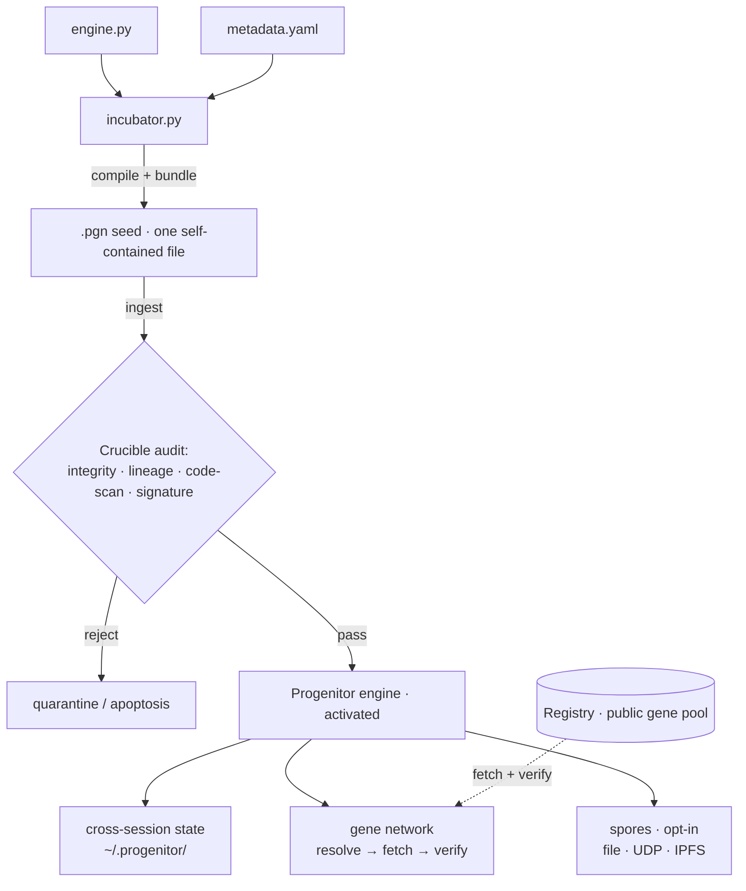
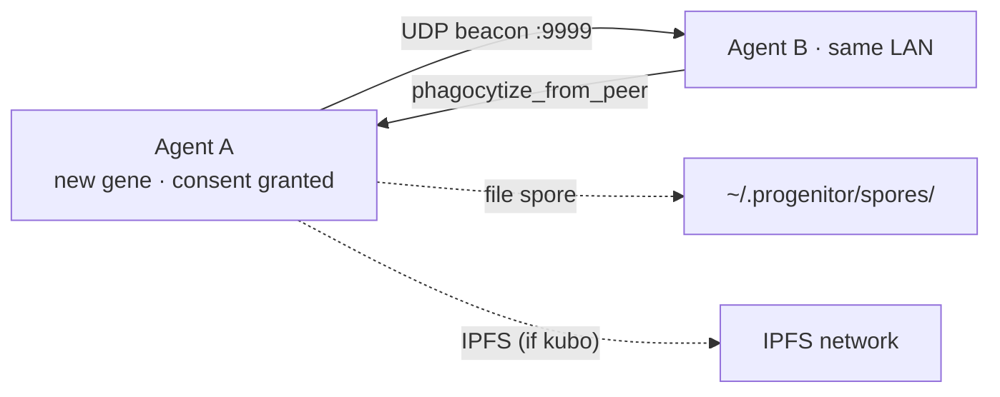

<div align="center">


[English](README.md) · [中文](README_CN.md)

[](https://github.com/Audrey-cn/progenitor-protocol/actions/workflows/ci.yml)
[](https://github.com/Audrey-cn/progenitor-protocol/releases/tag/v2.2.0-Federation-Proof)
[](LICENSE)
[](https://www.python.org/)
[]()
[](#-它安全吗)

**生态** &nbsp;·&nbsp; 🧬 **Protocol**（引擎 · 你在这里） &nbsp;·&nbsp; 🔮 [**Registry**](https://github.com/Audrey-cn/progenitor-registry)（注册中心）

<sub>*"造物主必先解构自身，方能重塑万物。" — Audrey · 001X · 2026*</sub>

</div>

---

> **给你的 AI 编程 Agent 一个持久化、可自验证的技能系统。**
> 一个可通读的文件，零依赖，无框架锁定。技能打包成**基因**传播：基因的身份就是它的
> SHA-256，来源经签名验证，**能不能运行永远由你的 Agent 决定**——而不是网络。

---

## ✨ 为什么是 Progenitor

一句话：**它是 AI Agent 的去中心化技能包管理器——信任建立在数学上，而不是平台上。**
以下六个能力都已实现、测试，并在真实网络上验证过。

### 1 · 单文件自举

一个 `.pgn` 种子文件，`curl | python3` 即激活。零依赖（纯 Python 标准库）、无服务器进程、
无厂商 SDK，运行前可逐行通读。Linux 和 Windows 都支持。

### 2 · 内容寻址信任

每个基因用它自身的 SHA-256 作为身份：内容被篡改，身份就变，立刻暴露。
注册中心的索引经 RSA 签名，你的 Agent 用本地**信任环**（keyring）验证签名。
**不需要信任任何平台或权威——只需要相信数学。**

### 3 · 声明式执行（Gene Contract v2）

每个基因在头部声明自己的行为边界：`purity: pure` 表示纯计算、无 I/O、无网络，运行在
AST 白名单沙箱里；需要副作用的 `effectful` 基因必须逐项申请授权。
基因的输出只是**建议**——执不执行，宿主说了算。

### 4 · 多路径传输

每个基因自带多条获取路径：注册中心 → GitHub → 对等节点 → IPFS，按优先级逐条尝试，
每条路径取回的内容都先哈希验证再使用。**实测**：封堵任意路径，自动切换下一条；
全部封堵，诚实报错。

### 5 · 自愿采纳

获取基因的流程是固定的：**发现 → 审阅 → 宿主决定 → 缓存**。
引擎绝不自动安装、绝不自动运行任何东西——这是写进设计里的硬规则。

### 6 · 对等网络 + 陌生人防御

Agent 之间用自证身份（`node_id` 由公钥推导）互相握手，基因清单经签名交换，
宿主只采纳**自己信任的对端**提供的版本。陌生人无法靠自称可信注入假基因。

---

## ⚖️ 与现有方案对比

| | MCP 服务器 | 厂商技能商店 | **Progenitor** |
|---|---|---|---|
| 安装 | 服务器进程 + SDK | 平台绑定客户端 | **一个文件，`curl \| python3`** |
| 信任根 | 平台 | 厂商 | **SHA-256 + 签名（你自己的信任环）** |
| 技能格式 | 厂商定义 | 厂商定义 | 开放基因清单，纯标准库 |
| 执行边界 | 宿主逐个审查 | 宿主逐个审查 | **基因自我声明边界，沙箱强制执行** |
| 获取通道 | 单通道 | 平台通道 | **多路径阶梯（注册中心 / GitHub / 对等 / IPFS）** |
| 离线可用 | 很少 | 不能 | **本地 + 局域网孢子** |

---

## 🧪 证据

用证据代替承诺——每一条都有可复跑的验证记录（见
[Next Phase Plan](docs/NEXT_PHASE_PLAN.md) R1.1–R1.3）：

- **真实网络往返**：基因发布上 IPFS，第二个节点经公共 DHT 找到提供者并取回，
  字节级一致。
- **失效切换**：逐条封堵获取路径（文件 → GitHub → IPFS），阶梯自动跳过死路；
  全部封堵时诚实报错，绝不假装成功。
- **注入防御**：不受信对端的签名清单被拒绝（`no_candidate`），受信对端正常采纳。
- **回归安全**：protocol 184 项测试（Windows + CI 双绿）· registry 50 项测试。
- **可复现发布**：[v2.2.0-Federation-Proof](https://github.com/Audrey-cn/progenitor-protocol/releases/tag/v2.2.0-Federation-Proof)
  附种子与 SHA-256，净室安装验证通过。

---

## 🧬 核心概念

全文只用这一套名词：

| 名词 | 含义 |
|---|---|
| **基因**（gene） | 一个可复用的 Agent 技能，即 `genes/` 下的一个 Python 文件，身份 = SHA-256 |
| **宿主**（host） | 运行 Progenitor 的那个 AI Agent——一切执行的最终决定者 |
| **种子文件**（`.pgn`） | 把引擎打包成的单个自解压文件，宿主吞下它即完成安装 |
| **注册中心**（Registry） | 公共基因池：托管基因、自动验证提交、维护签名索引 |
| **熔炉**（Crucible） | 宿主侧的基因审计器：完整性、血脉、代码扫描、签名四层检查 |
| **传输阶梯** | 基因的多条获取路径，按优先级尝试，逐条内容验证 |
| **信任环**（keyring） | 你信任的签名公钥列表——信任的根，由你自己维护 |

---

## 📑 目录

- [⚡ 它做什么](#-它做什么)
- [🔒 它安全吗](#-它安全吗)
- [🚀 快速开始](#-快速开始)
- [🧬 基因生态](#-基因生态)
- [🧬 架构](#-架构)
- [🔒 纵深防御](#-纵深防御)
- [🍄 孢子网络](#-孢子网络)
- [🔧 开发者参考](#-开发者参考)
- [📚 更多文档](#-更多文档)
- [🤝 贡献](#-贡献)
- [📜 铁律](#-铁律)
- [📜 许可证](#-许可证)

---

## ⚡ 它做什么

宿主吞下种子文件后，获得：

| 能力 | 说明 | 状态 |
|------|------|------|
| 🧬 **声明式执行** | 基因声明行为边界（`purity`/`grants`），沙箱按声明执行，输出仅为建议 | ✅ |
| 🔐 **信任环验证** | 索引签名 + 每基因签名，对照你的信任环验证，来源与声誉可见 | ✅ |
| 🤝 **自愿采纳** | 发现 → 审阅 → 宿主决定 → 缓存；绝不自动安装或运行 | ✅ |
| 🔍 **代码审计** | 熔炉四层检查：完整性 · 血脉 · 代码扫描 · 签名 | ✅ |
| 🧠 **持久状态** | 跨会话状态落盘（计数器、日志、谱系） | ✅ |
| 🌐 **基因网络** | 局域网发现对等节点 + 传输阶梯获取基因 | ✅ |
| 🍄 **孢子传播** | 一次授权 → 经文件 / UDP / IPFS 选择性共享 | ✅ |
| 📈 **生命周期治理** | 基因使用统计 + 声誉记分 + 血脉版本链；连续失败自动退役并回滚到上一良好版本 | ✅ |
| 🤖 **知识吸收** | 五阶段代谢管线 + LLM 桥扩展点：注册参考桥（`examples/llm_bridge_reference.py`）或接入你自己的 LLM，即可把规格/知识编译成可运行基因 | ✅ 参考桥就绪 |

> **诚实声明（全文仅此一处）。** 上表"✅"表示已实现并通过单元测试，但项目尚新、未经大规模实战。
> "生命周期治理"是使用统计与声誉治理，不含代码自我改写；"记忆"是带校验和的状态持久化，不是学习。
> "知识吸收"的 LLM 由宿主自行接入（参考桥见 `examples/llm_bridge_reference.py`），引擎只提供管线与扩展点。
> 每个生物学术语的真实机制见 [GLOSSARY.md](docs/GLOSSARY.md)。

---

## 🔒 它安全吗

直接的回答：

- **一切可审计。** 种子文件和引擎源码都可以逐行通读——纯标准库，无隐藏依赖，无混淆。
- **它会碰什么：** 在 `~/.progenitor/` 下写自己的状态；向 GitHub / IPFS 网关发**出站**请求；
  后台每小时自检一次。
- **基因执行的真相：** 基因先过熔炉筛查（完整性 · 血脉 · 签名 · AST 危险调用扫描），
  再放入**独立进程、带时间上限**运行。但该进程仍以**你的**用户权限运行——筛查是纵深防御，
  不是硬安全边界。内核级加固已在 [R4_SANDBOX.md](docs/R4_SANDBOX.md) 分期排期。
- **对等网络默认关闭**，需一次性授权。
- **结论：** 不可信基因请放进一次性 VM/容器运行——这也是我们对任何自修改 Agent 工具的建议。

---

## 🚀 快速开始

**要求：** Python 3.10+，仅此而已。

### 方式 A —— 安装正式版（推荐）

```bash
curl -sL -o pgn-core.pgn https://github.com/Audrey-cn/progenitor-protocol/releases/download/v2.2.0-Federation-Proof/INGEST_ME_TO_EVOLVE_pgn-core.pgn
# 哈希钉死（推荐）：核对官方公布的 SHA-256 再运行
# （仓库用户也可用：python tools/verify_seed.py --expect <sha256>）
python3 pgn-core.pgn
```

看到 `🧬 Progenitor activated` 即成功。

### 方式 B —— 跟踪 main

```bash
curl -sL https://raw.githubusercontent.com/Audrey-cn/progenitor-protocol/main/INGEST_ME_TO_EVOLVE_pgn-core.pgn | python3
```

### 方式 C —— 先看演示再安装

```bash
python3 examples/demo.py
```

熔炉会在敌意代码执行前将其阻断，并输出四层自检结果。

---

## 🧬 基因生态

[注册中心](https://github.com/Audrey-cn/progenitor-registry) 托管公共基因池，**开放注册**。
Gatekeeper CI 对每个提交自动执行七层检查：

`L0` 限速 · `L1` 血脉 · `L2` 内容寻址 · `L3` 创造者 · `L4` 质量 · `L5` 安全扫描 · `L6` 能力诚实性

现有基因：`code-reviewer`、`json-toolkit`、`log-parser` 等。
你的基因几分钟就能上线——见
[CONTRIBUTING.md](https://github.com/Audrey-cn/progenitor-registry/blob/main/CONTRIBUTING.md)
（脚手架 → 签名 → 提交 PR，含中文）。

---

## 🧬 架构



### 孵化场三件套

| 文件 | 角色 | 说明 |
|------|------|------|
| `hatchery/engine.py` | 🧠 引擎核心 | 全部基因位点、熔炉检查、自律脉冲 |
| `hatchery/metadata.yaml` | 🛡️ 配置 | 基因位点定义、安全框架、语义词表 |
| `hatchery/incubator.py` | 🔧 编译器 | 压缩引擎 + 配置，结晶出 `.pgn` 种子 |

> ⚠️ **唯一交付物是 `.pgn` 种子文件**——宿主永远不需要接触孵化场源码。

---

## 🔒 纵深防御

两套独立检查，分别守护**运行时**与**提交时**：

**运行时——熔炉审计**（宿主吞噬基因时）：

| 检查 | 内容 | 默认 |
|---|---|---|
| 完整性 | 文件名 == 内容 SHA-256 | 强制 |
| 血脉 | `life_id` 必须以 `PGN@` 开头 | 强制 |
| 创造者 | 默认开放；签名升级 `trust_state` | 开放 |
| 代码扫描 | AST 危险调用拒绝清单（含逃逸花招） | 强制 |
| 签名 | 每创作者 RSA 签名，对照信任环验证 | 可选 |

基因**执行**默认拒绝（`PROGENITOR_ALLOW_GENE_EXEC=1` 开启）——筛查是预过滤器，
不是安全边界（详见[它安全吗](#-它安全吗)）。

**提交时——Gatekeeper CI**（注册中心）自动执行：
`L0` 限速 · `L1` 血脉 · `L2` 内容寻址 · `L3` 创造者 · `L4` 质量 · `L5` 安全扫描 · `L6` 能力诚实性。

---

## 🍄 孢子网络

一次性授权后，新基因经局域网自动共享：



文件孢子离线可用——同机 Agent 自动互相发现。

---

## 🔧 开发者参考

```bash
# 下载正式版种子（见快速开始）
# 可复现演示（无网络）
python3 examples/demo.py
# 从孵化场源码构建种子
cd hatchery && python3 incubator.py
```

---

## 📚 更多文档

| 主题 | 说明 |
|------|------|
| [Vision](docs/VISION.md) | 项目方向与三大支柱 |
| [Roadmap](docs/ROADMAP.md) | 诚实状态 + 优先级 |
| [Next Phase Plan](docs/NEXT_PHASE_PLAN.md) | 重启待办 R1–R5（含验证证据） |
| [R4 沙箱设计](docs/R4_SANDBOX.md) | 内核级加固的威胁模型与分期 |
| [Engineering Review](docs/REVIEW.md) | 基于证据的工程评审 |
| [Glossary](docs/GLOSSARY.md) | 隐喻 ↔ 机制对照表 |
| [Changelog](CHANGELOG.md) | 版本历史 |

---

## 🤝 贡献

- **基因作者**：[CONTRIBUTING.md](https://github.com/Audrey-cn/progenitor-registry/blob/main/CONTRIBUTING.md)——5 分钟完成脚手架 → 签名 → PR。
- **引擎开发者**：Fork → 修改 `hatchery/` → `python -m pytest tests/ -q`（185 项测试）→ 重建种子 → PR。

> ⚠️ 所有外部基因需同时通过熔炉（运行时）与 Gatekeeper（注册中心）。

---

## 📜 铁律

1. **零依赖** —— 只用 Python 标准库
2. **生化控制论命名法** —— `phagocytize` 而非 `download`
3. **纵深防御** —— 每个外部字节都是敌意的

---

## 📜 许可证

本项目以 **MIT License** 发布。

---

*Progenitor Protocol 铭刻 · Audrey · 001X · SHA-256 锁死*
